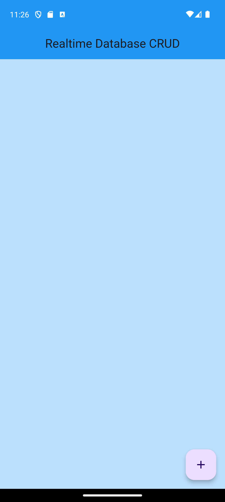

# 🔥 Firebase Realtime Database CRUD

A Flutter app demonstrating full **CRUD** (Create, Read, Update, Delete) against **Firebase Realtime Database**. It manages simple student records — each entry has a **name** and a **matric number**.

## ✨ Features

- **Read** — a live, auto‑updating list of records via `FirebaseAnimatedList`.
- **Create** — add a record (name + matric number) through a bottom‑sheet form.
- **Update** — edit an existing record from the per‑item menu.
- **Delete** — remove a record from the per‑item menu.

## 📱 Screenshot



## 🛠️ Tech

- **Flutter** (Material Design)
- `firebase_core` + `firebase_database`
- Firebase config via `lib/firebase_options.dart`

## 🚀 Run it

```bash
flutter pub get
flutter run
```

> **Requirements**
> - A Firebase project with Realtime Database enabled, wired up via `flutterfire configure` (`firebase_options.dart`) and `android/app/google-services.json`.
> - On **Windows**, building plugin‑based apps requires **Developer Mode** to be enabled (symlink support).
> - Make sure your Realtime Database **Security Rules** are set appropriately before publishing.

## 📝 Notes

A learning project for Firebase Realtime Database integration. The data keys used for create/read/update are slightly inconsistent in places (`matric` vs `Matric Number`), and delete targets a fixed node — left as‑is to reflect the original lab work.
